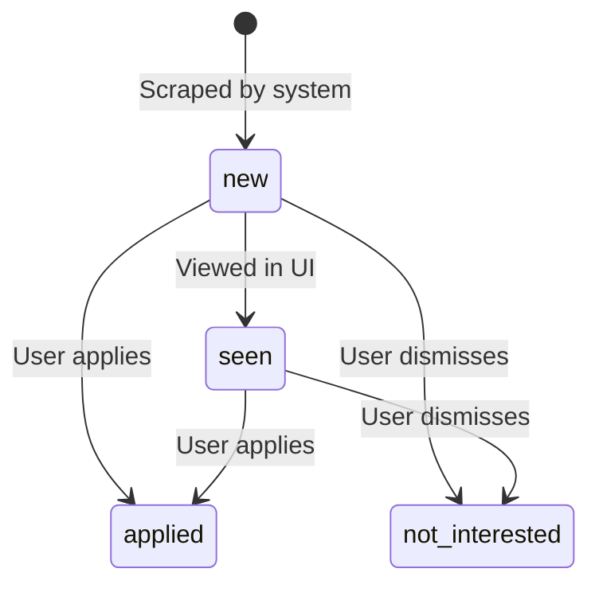

# Data Storage & Schema (`data/`)

This directory serves as the local database layer for the **CIFRE PhD Offers Scraper & Manager**. Scraped offers, metadata, and application tracking statuses are stored here in JSON format.

---

## 📁 File Structure

```text
data/
└── offers.json    # Local JSON database (gitignored by default)
```

> [!NOTE]
> `offers.json` is automatically created on the first scraper run or web server request if it does not already exist.

---

## 📄 JSON Database Schema (`offers.json`)

The database is formatted as a single JSON object containing global metadata and an array of individual offer objects.

### Root Object

| Field | Type | Description |
|---|---|---|
| `last_scrape` | `string` (ISO 8601) | Timestamp of the most recent scraping job execution (e.g., `"2026-07-27T09:51:10.598459"`). |
| `offers` | `array[object]` | List of all stored PhD thesis offers. |

---

### Offer Object Schema

Each object in the `offers` array follows this schema:

```json
{
  "id": "45f6c1bc30f41f63",
  "title": "CIFRE - Simulation de conduite en réalité étendue",
  "company": "Renault",
  "description": "Location: Guyancourt. Posted: T - Research & Development",
  "link": "https://alliancewd.wd3.myworkdayjobs.com/...",
  "source": "renault",
  "date_found": "2026-07-19",
  "status": "new"
}
```

#### Field Specifications

| Field | Type | Required | Description |
|---|---|---|---|
| `id` | `string` | Yes | **Deterministic 16-character hexadecimal hash** generated via SHA-256 from `source::link` (or `source::title::company`). Prevents duplicate entries. |
| `title` | `string` | Yes | Title of the PhD thesis offer or job position. |
| `company` | `string` | Yes | Name of the hiring company or research organization. |
| `description` | `string` | Yes | Text excerpt, location, mission statement, or department info. |
| `link` | `string` | Yes | Direct URL to the original offer posting. |
| `source` | `string` | Yes | Identifier of the scraper module (e.g., `doctorat_gouv`, `safran`, `airbus`). |
| `date_found` | `string` | Yes | YYYY-MM-DD date when the offer was first recorded by the system. |
| `status` | `string` | Yes | User tracking status. Must be one of the lifecycle states detailed below. |

---

## 🔄 Offer Lifecycle States

Offers progress through four tracking statuses in the system:



1. **`new`**: Default state assigned to newly scraped offers. Visually highlighted with a badge in the web UI.
2. **`seen`**: Offer acknowledged by the user.
3. **`applied`**: User has submitted an application. Stored permanently for tracking.
4. **`not_interested`**: Dismissed by user. Filtered out by default in the active dashboard view.

---

## 🔒 Data Privacy & Version Control

- `data/offers.json` is listed in `.gitignore`.
- This ensures your personal application status tracking, candidate preferences, and local scraping history remain strictly private and are **never committed to public GitHub repositories**.
