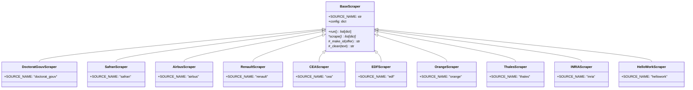

# Scraper Modules & Architecture (`scrapers/`)

This directory contains all web scraping and API integration modules used by the **CIFRE PhD Offers Scraper & Manager**. Each scraper target a specific recruiter portal, company career site, or job aggregator to aggregate CIFRE thesis opportunities into a unified format.

---

## 🏗️ Architecture Overview

All scrapers inherit from the abstract base class [`BaseScraper`](file:///c:/Users/Dario/Desktop/Dario/Progetti/cifre_scraper/scrapers/base.py).



### BaseScraper Workflow

1. **`scrape()`** *(Abstract method)*: Implemented by each subclass. Fetches raw job listings from the target source and returns a list of dictionaries containing `title`, `company`, `description`, and `link`.
2. **`run()`** *(Base method)*: Wraps `scrape()`, automatically adding:
   - `source`: Set to `self.SOURCE_NAME`
   - `date_found`: Set to current ISO date (`YYYY-MM-DD`)
   - `id`: Deterministic 16-character SHA-256 hash calculated via `_make_id()`

---

## 📡 Supported Scraper Modules

| Source ID | Scraper File | Target Portal / Organization | Tech Stack / Bypass Strategy |
|---|---|---|---|
| `doctorat_gouv` | [`doctorat_gouv.py`](file:///c:/Users/Dario/Desktop/Dario/Progetti/cifre_scraper/scrapers/doctorat_gouv.py) | **Doctorat.gouv.fr** (French National PhD Portal) | Playwright headless browser navigation & detailed proposal page parsing. |
| `safran` | [`safran.py`](file:///c:/Users/Dario/Desktop/Dario/Progetti/cifre_scraper/scrapers/safran.py) | **Safran Group Careers** | Playwright with stealth evasions to bypass Cloudflare protection. |
| `airbus` | [`airbus.py`](file:///c:/Users/Dario/Desktop/Dario/Progetti/cifre_scraper/scrapers/airbus.py) | **Airbus Careers** | Direct REST requests to Airbus Workday JSON endpoints. |
| `renault` | [`renault.py`](file:///c:/Users/Dario/Desktop/Dario/Progetti/cifre_scraper/scrapers/renault.py) | **Renault Group Careers** | Direct REST requests to Alliance Workday JSON endpoints. |
| `cea` | [`cea.py`](file:///c:/Users/Dario/Desktop/Dario/Progetti/cifre_scraper/scrapers/cea.py) | **CEA (Commissariat à l'Énergie Atomique)** | ASP.NET WebForms session tracking & BeautifulSoup HTML parsing. |
| `edf` | [`edf.py`](file:///c:/Users/Dario/Desktop/Dario/Progetti/cifre_scraper/scrapers/edf.py) | **EDF Careers** | Playwright WebKit browser rendering to bypass Akamai WAF protections. |
| `orange` | [`orange.py`](file:///c:/Users/Dario/Desktop/Dario/Progetti/cifre_scraper/scrapers/orange.py) | **Orange Jobs** | Requests / JSON API endpoint matching configured PhD title keywords. |
| `thales` | [`thales.py`](file:///c:/Users/Dario/Desktop/Dario/Progetti/cifre_scraper/scrapers/thales.py) | **Thales Group** | Workday / career portal API query integration. |
| `inria` | [`inria.py`](file:///c:/Users/Dario/Desktop/Dario/Progetti/cifre_scraper/scrapers/inria.py) | **INRIA (Institut National de Recherche en Informatique)** | HTML scraping targeting CIFRE tagged scientific position postings. |
| `hellowork` | [`hellowork.py`](file:///c:/Users/Dario/Desktop/Dario/Progetti/cifre_scraper/scrapers/hellowork.py) | **HelloWork Aggregator** | HTML search parsing with filtering to ignore offers from directly scraped companies. |

---

## ⚡ Smart Features & Optimization Strategies

### 1. Anti-Duplication via Aggregator Filtering
Aggregators like **HelloWork** often repost offers from direct company sites (e.g. Airbus, Safran, Thales). To prevent duplicate cards in the database, aggregator scrapers consult `skip_companies_on_aggregators` in `config.json`:

```json
"skip_companies_on_aggregators": [
  "Safran", "Airbus", "Renault", "CEA", "EDF", "Orange", "Thales", "Inria"
]
```
If an offer's company matches an entry in this list, the aggregator scraper discards it automatically.

### 2. Early-Exit Deduplication Strategy
During sequential scraping, if the scraper encounters an offer `id` that already exists in `data/offers.json`, it can immediately stop requesting further pagination pages. This significantly reduces idle wait times and bandwidth usage.

### 3. Deterministic Hashing
Offer IDs are generated using:
```python
raw = f"{offer['source']}::{offer['link']}" # or source::title::company
hashlib.sha256(raw.encode("utf-8")).hexdigest()[:16]
```
This guarantees identical IDs across repeated runs regardless of execution order.

---

## 🛠️ How to Add a New Scraper

To add a scraper for a new company or job board:

1. **Create a new python file** in `scrapers/` (e.g., `scrapers/custom_company.py`).
2. **Subclass `BaseScraper`** and define `SOURCE_NAME`:

```python
from scrapers.base import BaseScraper

class CustomCompanyScraper(BaseScraper):
    SOURCE_NAME = "custom_company"

    def scrape(self) -> list[dict]:
        offers = []
        # Implement fetching & parsing logic here
        # Return dicts with: {"title": ..., "company": ..., "description": ..., "link": ...}
        return offers
```

3. **Register the new class** in [`scrapers/__init__.py`](file:///c:/Users/Dario/Desktop/Dario/Progetti/cifre_scraper/scrapers/__init__.py):

```python
from scrapers.custom_company import CustomCompanyScraper

ALL_SCRAPERS = [
    # ...
    CustomCompanyScraper,
]
```
